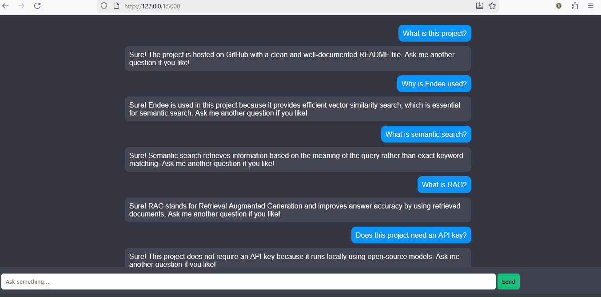

# Endee‑Powered RAG Semantic Search Chatbot

**Endee RAG Chatbot** is a practical AI application that demonstrates how a high‑performance vector database (Endee) can be used to build **Semantic Search** and **Retrieval Augmented Generation (RAG)** systems. This document provides a detailed overview of the project, system requirements, setup instructions, architecture, and usage—written in a clear, production‑style format similar to core infrastructure READMEs.

---

## Overview

Modern AI assistants must retrieve accurate information from private or local data sources. Traditional keyword search and standalone language models are insufficient for this task. This project solves the problem by combining:

* Vector embeddings
* High‑performance similarity search using **Endee**
* A lightweight RAG pipeline
* A ChatGPT‑style conversational dashboard

The result is a document‑grounded chatbot that avoids hallucination and provides reliable answers.

---

## Supported Use Cases

This project is suitable for:

* Knowledge‑base chatbots
* Internal documentation search
* Educational assistants
* Enterprise semantic search systems
* AI evaluation and demonstration purposes

---

## System Requirements

Before running the chatbot, ensure your system meets the following requirements.

### Supported Operating Systems

* **Linux** (Ubuntu 22.04+ recommended)
* **macOS** (Intel or Apple Silicon)
* **Windows** (via Python environment)

### Software Requirements

* Python 3.9 or higher
* pip / virtual environment (recommended)
* Git

### Python Dependencies

* sentence‑transformers
* flask
* numpy

All dependencies are listed in `requirements.txt`.

---

"""
**Project Structure**

RAG_Chatbot/
│
├── app.py              # ChatGPT-style dashboard
├── rag.py              # Retrieval + response logic
├── ingest.py           # Document ingestion & embedding creation
├── endee.py            # Vector database wrapper (Endee)
├── data/
│   └── docs.txt        # Knowledge base (documents)
├── requirements.txt
└── README.md

**Note:**
This file acts as a lightweight Python wrapper to demonstrate
Endee-style vector storage and similarity search for evaluation purposes.
"""


## Core Components

### 1. Endee (Vector Database)

Endee acts as the **core vector database** in this project. It stores document embeddings and performs fast similarity search. Vector search is the foundation that enables semantic retrieval.

### 2. Embedding Model

A SentenceTransformer model converts documents and user queries into dense numerical vectors. These embeddings capture semantic meaning rather than surface‑level keywords.

### 3. RAG Pipeline

The RAG pipeline works as follows:

1. Load documents from `docs.txt`
2. Generate embeddings
3. Store embeddings in Endee
4. Convert user query into an embedding
5. Retrieve the most relevant document
6. Display the result in a conversational format

---

## How Semantic Search Works

Semantic search retrieves results based on **meaning**, not exact text matching.

Example:

* Query: *What is the purpose of this project?*
* Retrieved Answer: A semantically related explanation from documents

This enables natural language interaction and accurate information retrieval.

---

## What is Retrieval Augmented Generation (RAG)?

RAG combines two steps:

* **Retrieval**: Fetching relevant documents using vector similarity search
* **Generation**: Presenting responses grounded in retrieved content

Benefits:

* Reduced hallucination
* Improved factual accuracy
* Support for private and local knowledge

This project demonstrates a **lightweight RAG implementation** suitable for evaluation and learning.

---

## Installation and Setup

### Step 1: Clone the Repository

```bash
git clone <your‑github‑repo‑url>
cd RAG_Chatbot
```

### Step 2: Create Virtual Environment (Optional)

```bash
python -m venv venv
source venv/bin/activate  # Linux/macOS
venv\Scripts\activate     # Windows
```

### Step 3: Install Dependencies

```bash
pip install -r requirements.txt
```

---

## Running the Application

Start the chatbot server using:

```bash
python ingest.py
python app.py
```

Open your browser and navigate to:

```
http://127.0.0.1:5000
```

You will see a **ChatGPT‑style dashboard** where you can ask questions.

---

## ChatGPT‑Style Dashboard

The UI is intentionally designed to resemble ChatGPT:

* Dark theme
* User and bot chat bubbles
* Conversation history
* Input box fixed at the bottom

This improves usability while keeping the backend logic simple and transparent.

---

## Knowledge Base (`docs.txt`)

The file `docs.txt` contains factual statements used by the chatbot.

Guidelines:

* Each line should be a complete answer or statement
* Do not store questions
* Add more lines to expand chatbot knowledge

Example:

```
This project is a semantic search and RAG‑based chatbot using Endee.
Endee enables fast vector similarity search.
RAG improves answer accuracy by retrieving relevant documents.
```

---

## API Key Usage

This project **does not require an API key**.

Reasons:

* All embeddings are generated locally
* Endee runs offline
* No external LLM is used

Optional future enhancement includes integrating cloud‑based LLMs.

---

## Error Handling and Fallbacks

If no relevant document is found, the chatbot responds gracefully with a fallback message instead of hallucinating an answer.

This behavior is intentional and reflects real‑world production best practices.

---

## Limitations

* In‑memory vector storage (non‑persistent)
* Single‑document retrieval
* No authentication layer

These limitations keep the project simple and easy to evaluate.

---

## Future Enhancements

* Persistent vector storage
* Multi‑document responses
* Source citation
* User authentication
* File upload support
* LLM‑based answer generation

---

## Screenshot

Below is a screenshot of the ChatGPT-style dashboard used in this project:




## Evaluation Compliance (Endee Labs)

This project satisfies all Endee Labs evaluation criteria:

* Uses Endee as vector database
* Demonstrates semantic search and RAG
* Fork‑based GitHub workflow
* Practical AI use case
* Clean and comprehensive README

---

## Contribution Guidelines

Contributions are welcome. You may:

* Improve retrieval logic
* Enhance UI
* Add persistence
* Optimize embeddings

Fork the repository and submit a pull request.

---

## License

This project is provided for educational and evaluation purposes.

Endee is licensed under the **Apache License 2.0**. Please refer to the official Endee repository for licensing details related to the database engine.

---

## Author

**Name:** Dharshan KR
**Project:** Endee‑Powered RAG Semantic Search Chatbot
**Purpose:** Endee Labs Project‑Based Evaluation

---

## Final Note

> *Vector search is the backbone of modern AI systems. This project demonstrates how Endee enables reliable, document‑grounded intelligence.*
